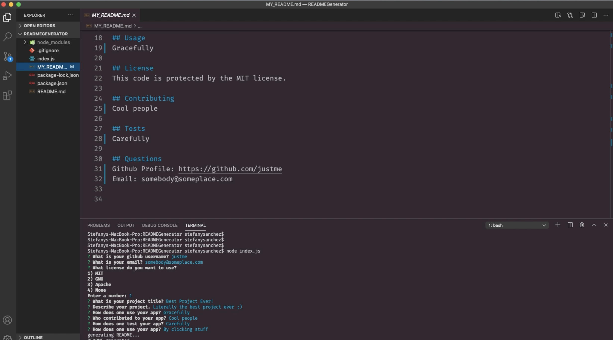

# Unit 09 Node.js and ES6+ Homework: Good README Generator

When creating an open source project on GitHub, it is important to have a quality README with information about the app--what is the app for, how to use the app, how to install it, how to report issues, and how to make contributions so that other developers are more likely to use and contribute to the success of the project. A command-line application will allow for quick and easy generation of a project README to get started quickly. This will allow a project creator to spend more time working on finishing the project and less time creating a good README.

My task was to create a command-line application that dynamically generates a professional README.md from a user's input using the [Inquirer package](https://www.npmjs.com/package/inquirer).

Because this is a command-line application that won’t be deployed, I provided a walkthrough video that demonstrates the functionality of my application. 

 [Check out my video here!](https://drive.google.com/file/d/1SEcC_Fykddi6K5ctFwrhoA_yEAPLQf3_/view?usp=sharing)

